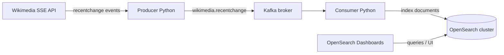

# Wikimedia → Kafka → OpenSearch (Python)

A small **end-to-end streaming demo**: a Python producer reads the public [Wikimedia recent change Server-Sent Events (SSE) stream](https://stream.wikimedia.org/), publishes JSON events to **Apache Kafka**, and a Python consumer indexes those documents into **OpenSearch**. Everything is wired together with **Docker Compose** for a one-command local stack.

> **Not for production.** Security plugins are disabled on OpenSearch and Dashboards for simplicity. Use this for learning and local development only.

## Architecture



| Piece | Role |
|--------|------|
| **Producer** (`producer/`) | `GET` SSE from `stream.wikimedia.org`, parse JSON, produce to topic `wikimedia.recentchange`. |
| **Kafka** | Single-node KRaft mode (`apache/kafka`). Topic has 3 partitions (broker default). |
| **Consumer** (`consumer/`) | Subscribe to the topic, create index `wikimedia-changes` if missing, index each event by Wikimedia change `id`. |
| **OpenSearch** | Two nodes, clustered; data persisted in named volumes. |
| **OpenSearch Dashboards** | Web UI for Discover and queries on port **5601**. |

## Prerequisites

- [Docker](https://docs.docker.com/get-docker/) and [Docker Compose](https://docs.docker.com/compose/) v2
- Enough RAM for OpenSearch (two JVMs at 512 MiB each in the default compose file, plus Kafka and Python containers). **~4 GiB host RAM** is a comfortable minimum.

## Quick start

**Recommended (clean volumes + rebuild + detach):**

```bash
make up_clean
```

**Equivalent without Make:**

```bash
docker compose down --remove-orphans --volumes
docker compose up --build -d
```

**Other Make targets:**

| Target | Purpose |
|--------|---------|
| `make up` | Start stack without removing volumes |
| `make down` | Stop stack, keep volumes |
| `make clean` | Stop and remove containers **and** volumes |
| `make ps` | Show running services |

Services start in dependency order for Kafka; the producer and consumer **retry** Kafka/OpenSearch in a loop until connections succeed (see `producer/main.py` and `consumer/main.py`).

## Service endpoints (host machine)

| Service | URL / host |
|---------|------------|
| OpenSearch REST | http://localhost:9200 |
| OpenSearch Dashboards | http://localhost:5601 |
| Kafka | `localhost:9092` is **not** published by default; clients run **inside** the compose network and use `broker:9092` |

## Verify the pipeline

1. **Cluster health**

   ```bash
   curl -s http://localhost:9200/_cluster/health?pretty
   ```

2. **Document count** (after the consumer has run a short while)

   ```bash
   curl -s "http://localhost:9200/wikimedia-changes/_count?pretty"
   ```

3. **Sample search** (titles containing “Python”, for example)

   ```bash
   curl -s "http://localhost:9200/wikimedia-changes/_search?q=title:Python&pretty" | head
   ```

4. In **OpenSearch Dashboards** (http://localhost:5601), create a data view / index pattern for `wikimedia-changes` and use **Discover**.

## Configuration (code constants)

There is no `.env` file today. Tunables are set in Python:

- **Producer:** `WIKIMEDIA_STREAM_URL`, `KAFKA_TOPIC`, `KAFKA_BROKERS` in `producer/main.py`.
- **Consumer:** `KAFKA_TOPIC`, `KAFKA_BROKERS`, `OPENSEARCH_HOST`, `OPENSEARCH_INDEX` in `consumer/main.py`.

For Docker-only use, keep broker and OpenSearch hostnames aligned with `docker-compose.yml` service names.

## Project layout

```
├── docker-compose.yml    # Kafka, OpenSearch x2, Dashboards, producer, consumer
├── Makefile              # up_clean, up, down, clean, ps
├── producer/
│   ├── Dockerfile
│   ├── main.py
│   └── requirements.txt  # kafka-python, requests, sseclient-py
└── consumer/
    ├── Dockerfile
    ├── main.py
    └── requirements.txt  # kafka-python, opensearch-py
```

Both apps use **Python 3.11** slim images and mount their source directories for quick iteration.

## Troubleshooting

- **Consumer logs “OpenSearch not available”** — Normal on first boot; OpenSearch can take a minute. The consumer retries.
- **No documents in OpenSearch** — Confirm `consumer-app` is running (`docker compose ps` or `make ps`). Confirm Wikimedia stream is reachable from the producer container.
- **Out of memory** — Reduce `OPENSEARCH_JAVA_OPTS` in `docker-compose.yml` or run a single OpenSearch node for lighter setups.

## TODO / improvement proposals

Ideas to evolve this demo into something sturdier or closer to production patterns:

- **Compose reliability:** Add Docker Compose `healthcheck` entries for Kafka and OpenSearch; use `depends_on: condition: service_healthy` so producer/consumer start only when dependencies are ready instead of relying only on retry loops.
- **Configuration:** Move URLs, topic names, index names, and retry limits to environment variables (and optionally a shared `.env.example`).
- **OpenSearch mapping:** Replace dynamic mapping with an explicit index template / mapping for known Wikimedia recentchange fields (keyword vs text, dates) to improve relevance and disk use.
- **Document identity:** Handle missing or duplicate `id` in events (fallback ID, or use Kafka offset + partition as a composite key) to avoid index errors or unintended overwrites.
- **Consumer semantics:** Consider `enable_auto_commit=False` with explicit commits after successful indexing, and/or a dead-letter strategy for poison messages.
- **Observability:** Replace `print` with structured logging; add Prometheus metrics or simple health HTTP endpoints for producer/consumer.
- **Testing:** Add unit tests for serialization/deserialization and integration tests against Kafka/OpenSearch (e.g. Testcontainers).
- **CI:** Linting (ruff/black), type hints (mypy), and a GitHub Action (or similar) that builds images and runs tests.
- **Security:** Document a “secure mode” path enabling OpenSearch security plugin, TLS, and auth—separate from this educational default.
- **Operations:** Pin image tags instead of `:latest`; document backup/restore of OpenSearch volumes; add a minimal `docker compose` profile for single-node OpenSearch for low-RAM machines.

Contributions that tackle items above are welcome if you fork or extend this repository.
