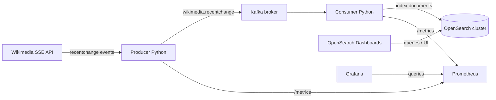

# Wikimedia → Kafka → OpenSearch (Python)

A small **end-to-end streaming demo**: a Python producer reads the public [Wikimedia recent change Server-Sent Events (SSE) stream](https://stream.wikimedia.org/), publishes JSON events to **Apache Kafka**, and a Python consumer indexes those documents into **OpenSearch**. Everything is wired together with **Docker Compose** for a one-command local stack.

> **Not for production.** Security plugins are disabled on OpenSearch and Dashboards for simplicity. Use this for learning and local development only.

## Architecture



| Piece | Role |
|--------|------|
| **Producer** (`producer/`) | `GET` SSE from `stream.wikimedia.org`, parse JSON, produce to topic `wikimedia.recentchange`. JSON **logs**, **`/healthz`** / **`/ready`** / **`/metrics`** on `OBS_HTTP_PORT`. |
| **Kafka** | Single-node KRaft mode — Docker image **`apache/kafka:3.9.0`**. Topic has 3 partitions (broker default). |
| **Consumer** (`consumer/`) | Subscribe with **`enable_auto_commit=False`**, index to OpenSearch, then **commit offsets**; DLQ by default. JSON **logs** and the same **observability HTTP** endpoints as the producer. |
| **OpenSearch** | Two nodes — **`opensearchproject/opensearch:2.17.1`**; data in named volumes. |
| **OpenSearch Dashboards** | **`opensearchproject/opensearch-dashboards:2.17.1`** on port **5601**. |
| **Prometheus** | **`prom/prometheus:v2.55.1`**; scrapes app **`/metrics`** (`monitoring/prometheus/prometheus.yml`). UI on port **9090**. |
| **Grafana** | **`grafana/grafana:11.3.0`** on port **3000**; **Prometheus** datasource and provisioned dashboards (`monitoring/grafana/`). Default login **`admin` / `admin`** (override via env). |

Compose services use **pinned tags** (no `:latest`); see the comment at the top of **`docker-compose.yml`** when upgrading.

## Prerequisites

- [Docker](https://docs.docker.com/get-docker/) and [Docker Compose](https://docs.docker.com/compose/) v2
- Enough RAM for OpenSearch (two JVMs at 512 MiB each in the default compose file, plus Kafka and Python containers). **~4 GiB host RAM** is a comfortable minimum.

## Quick start

**Recommended (clean volumes + rebuild + detach):**

```bash
make up_clean
```

**Equivalent without Make:**

```bash
docker compose down --remove-orphans --volumes
docker compose up --build -d
```

**Other Make targets:**

| Target | Purpose |
|--------|---------|
| `make up` | Start stack without removing volumes |
| `make down` | Stop stack, keep volumes |
| `make clean` | Stop and remove containers **and** volumes |
| `make ps` | Show running services |

### Compose health and startup order

`docker-compose.yml` defines **healthchecks** so Compose can wait for dependencies before starting the Python apps:

| Service | Health check |
|---------|----------------|
| **broker** | `kafka-broker-api-versions.sh --bootstrap-server broker:9092` (KRaft broker accepting clients). |
| **opensearch-node1** / **opensearch-node2** | HTTP `/_cluster/health`; status must be **green** or **yellow** (cluster usable for indexing). |

**`depends_on`** with `condition: service_healthy`:

- **producer-app** starts only after **broker** is healthy.
- **consumer-app** starts only after **broker**, **opensearch-node1**, and **opensearch-node2** are all healthy.

`start_period` / `retries` on those healthchecks allow Kafka and the two-node OpenSearch cluster time to finish booting. The producer and consumer still contain **in-app retry loops** for transient failures after startup (see `producer/main.py` and `consumer/main.py`).

Inspect status: `docker compose ps` (shows `healthy` / `starting` in the **State** column when supported).

## Service endpoints (host machine)

| Service | URL / host |
|---------|------------|
| OpenSearch REST | http://localhost:9200 |
| OpenSearch Dashboards | http://localhost:5601 |
| Producer observability | http://localhost:**8080** — `GET /healthz` (liveness), `GET /ready` (503 until Kafka client is ready), `GET /metrics` (Prometheus) |
| Consumer observability | http://localhost:**8081** — same paths; `/ready` returns 503 until Kafka consumer + OpenSearch + optional DLQ producer are initialized |
| Prometheus | http://localhost:**9090** — targets, graph UI, `/metrics` self-scrape |
| Grafana | http://localhost:**3000** — open **Dashboards** for **Wikimedia pipeline** and **PWKO — Scrape health** (loaded from `monitoring/grafana/dashboards/`). |
| Kafka | `localhost:9092` is **not** published by default; clients run **inside** the compose network and use `broker:9092` |

Host ports **`8080`** / **`8081`** are configurable via `PRODUCER_OBS_HOST_PORT` and `CONSUMER_OBS_HOST_PORT` (see `.env.example`). Inside each app container the server listens on **`OBS_HTTP_PORT`** (default `8080`). **`PROMETHEUS_HOST_PORT`** (default **9090**) and **`GRAFANA_HOST_PORT`** (default **3000**) control Prometheus and Grafana.

## Verify the pipeline

1. **Cluster health**

   ```bash
   curl -s http://localhost:9200/_cluster/health?pretty
   ```

2. **Document count** (after the consumer has run a short while)

   ```bash
   curl -s "http://localhost:9200/wikimedia-changes/_count?pretty"
   ```

3. **Sample search** (titles containing “Python”, for example)

   ```bash
   curl -s "http://localhost:9200/wikimedia-changes/_search?q=title:Python&pretty" | head
   ```

4. In **OpenSearch Dashboards** (http://localhost:5601), create a data view / index pattern for `wikimedia-changes` (or the value of `OPENSEARCH_INDEX` if you changed it) and use **Discover**.

## Configuration (environment variables)

Tunables are read from the process environment. Defaults match the previous hard-coded values, so `docker compose up` works with no `.env` file.

**Docker Compose:** `producer-app` and `consumer-app` receive variables from the `environment` section in `docker-compose.yml`, which uses `${VAR:-default}` substitution. Compose automatically loads a **`.env`** file in the project root (if present) for that substitution—so you can copy `.env.example` to `.env` and edit values there without changing the compose file.

**Local runs** (without Compose): export the same variable names before `python main.py`, or use a tool of your choice to load `.env`.

| Variable | Apps | Default | Purpose |
|----------|------|---------|---------|
| `WIKIMEDIA_STREAM_URL` | Producer | `https://stream.wikimedia.org/v2/stream/recentchange` | Wikimedia SSE endpoint. |
| `KAFKA_BOOTSTRAP_SERVERS` | Both | `broker:9092` | Kafka brokers (comma-separated `host:port`). Use `broker:9092` inside this Compose network. |
| `KAFKA_TOPIC` | Both | `wikimedia.recentchange` | Topic name. |
| `KAFKA_CONSUMER_GROUP` | Consumer | `wikimedia-consumer-group` | Kafka consumer group id. |
| `KAFKA_DLQ_TOPIC` | Consumer | `wikimedia.recentchange.dlq` | Topic for poison / failed documents (JSON envelope with error + payload). Set to empty to disable DLQ (offset is still committed so the consumer does not stall). |
| `OPENSEARCH_HOST` | Consumer | `opensearch-node1` | OpenSearch hostname (compose service name). |
| `OPENSEARCH_PORT` | Consumer | `9200` | OpenSearch HTTP port. |
| `OPENSEARCH_INDEX` | Consumer | `wikimedia-changes` | Target index (created if missing). |
| `KAFKA_CLIENT_RETRY_MAX_ATTEMPTS` | Both | `10` | Max attempts to create Kafka producer/consumer. |
| `KAFKA_CLIENT_RETRY_DELAY_SECONDS` | Both | `5` | Sleep between Kafka connection retries (seconds). |
| `OPENSEARCH_RETRY_MAX_ATTEMPTS` | Consumer | `20` | Max attempts to connect and prepare the index. |
| `OPENSEARCH_RETRY_DELAY_SECONDS` | Consumer | `5` | Sleep between OpenSearch retries (seconds). |
| `LOG_LEVEL` | Both | `INFO` | Root log level (`DEBUG`, `INFO`, `WARNING`, `ERROR`). |
| `OBS_HTTP_PORT` | Both | `8080` | Port inside the container for health + Prometheus metrics HTTP server. |
| `PRODUCER_OBS_HOST_PORT` | Compose | `8080` | Published host port for **producer** observability (`host:OBS_HTTP_PORT`). |
| `CONSUMER_OBS_HOST_PORT` | Compose | `8081` | Published host port for **consumer** observability. |
| `PROMETHEUS_HOST_PORT` | Compose | `9090` | Prometheus UI and API on the host. |
| `GRAFANA_HOST_PORT` | Compose | `3000` | Grafana UI on the host. |
| `GRAFANA_ADMIN_USER` | Compose | `admin` | Grafana admin username. |
| `GRAFANA_ADMIN_PASSWORD` | Compose | `admin` | Grafana admin password (**change for anything beyond local demo**). |

Shared template: **[`.env.example`](.env.example)**. Copy to `.env` to override; `.env` is gitignored.

Verification commands above use the default index name `wikimedia-changes`; if you set `OPENSEARCH_INDEX`, substitute that name in URLs.

### OpenSearch mapping and index template

Wikimedia [recentchange](https://github.com/wikimedia/mediawiki-event-schemas/blob/master/jsonschema/mediawiki/recentchange/current.yaml) events are indexed with **explicit field types** (for example `title` as `text` with a `keyword` subfield for sorting/aggregations, `meta.dt` as `date`, filters as `keyword`/`boolean`/`integer`, and `log_params` stored but not mapped per-field to avoid noisy dynamic objects).

- **Composable index template** `wikimedia-recentchange` matches new indices named `wikimedia-*` so extra indices created later inherit the same settings/mappings.
- **New index creation** from the consumer uses the same JSON payload as the template (`consumer/wikimedia_mappings.py`), so the default `OPENSEARCH_INDEX` gets the mapping even before any document is indexed.
- **`dynamic` is `false`**: fields not declared in the mapping remain in `_source` only (fewer surprise mappings, typically smaller and more predictable indexes). Extend `wikimedia_mappings.py` if you need to query new properties.

If the index already existed from an older run (empty or dynamic mapping), OpenSearch will **not** retrofit this mapping: delete the index (or reindex) and restart the consumer—see **Troubleshooting**.

### Document identity (`_id` in OpenSearch)

Each indexed document gets an explicit `_id` so missing Wikimedia ids do not break indexing, and natural keys are preferred over Kafka position where possible:

1. **`meta.id`** — WMF event UUID (when `meta` is present and `meta.id` is non-empty). Prefer this for stable, idempotent re-indexing of the same event and to avoid cross-event collisions on `id` (rcid) in odd payloads.
2. **`id`** — MediaWiki recentchange id (rcid) when set (including `0` if it ever appears).
3. **Fallback** — `kafka:<topic>:<partition>:<offset>` from the consumer record so every consumed message has a unique key even when both ids are absent.

Replays of the **same** event (same `meta.id` or same `id`) overwrite the same OpenSearch document, which is usually desirable; distinct Kafka records with missing ids each get a distinct fallback `_id`.

### Consumer semantics (commits and dead-letter queue)

The consumer disables Kafka’s **auto-commit** and, after each message, calls **`commit()`** with an explicit **`OffsetAndMetadata`** for that record’s `TopicPartition` (next offset = `message.offset + 1`). Successful OpenSearch indexing and the “skip after handling failure” paths both advance the offset so partitions do not hang indefinitely.

If indexing (or validation) raises, the consumer **publishes a JSON envelope** to **`KAFKA_DLQ_TOPIC`** (default `wikimedia.recentchange.dlq`): error string and type, source `topic` / `partition` / `offset`, record `timestamp`, optional `key`, and the **`document`** body. Only after a successful DLQ publish does it commit when the main path failed. If DLQ **publish** fails, the offset is **not** committed so the message is retried.

Set **`KAFKA_DLQ_TOPIC`** to an empty string to turn off DLQ publishing; failed messages are logged and the offset is still committed (no infinite retry on poison payloads).

### Observability (logs, health, Prometheus)

- **Structured logging:** Both apps log **one JSON object per line** to stdout (`timestamp`, `level`, `logger`, `message`, `service`, `event`, and any `extra={...}` fields). `PYTHONUNBUFFERED=1` is set in Compose for timely log shipping.
- **HTTP:** A small background **`ThreadingHTTPServer`** serves **`/healthz`** and **`/health`** (always 200 if the process is up), **`/ready`** / **`/readiness`** (503 until the app finishes startup dependencies—Kafka producer ready on the producer; consumer + OpenSearch + DLQ producer ready on the consumer), and **`/metrics`** in the **Prometheus text exposition format** (`prometheus_client`).
- **Metrics (examples):** `wikimedia_producer_events_total`, `wikimedia_producer_errors_total`, `wikimedia_consumer_indexed_total`, `wikimedia_consumer_dlq_total`, `wikimedia_consumer_process_errors_total`, `wikimedia_consumer_offsets_committed_total`.

Implementation lives in **`producer/observability.py`** and **`consumer/observability.py`**.

**Prometheus + Grafana:** Compose services **`prometheus`** and **`grafana`** scrape the app **`/metrics`** endpoints on the Docker network (`producer-app:8080`, `consumer-app:8080`). Dashboards are **JSON** files auto-loaded at Grafana start:

| Dashboard | File | Contents (summary) |
|-----------|------|---------------------|
| **Wikimedia pipeline (Kafka / OpenSearch)** | `monitoring/grafana/dashboards/pwko-pipeline.json` | Producer throughput & error rates; consumer index/offset rates; DLQ and process-error totals; `up` for scrape targets. |
| **PWKO — Scrape health** | `monitoring/grafana/dashboards/pwko-scrape-health.json` | Scrape latency and a table of target **up** state. |

After `docker compose up`, open Grafana → **Dashboards** (folder *General*, tags `pwko`). Edit the JSON under `monitoring/grafana/dashboards/` and restart Grafana or use **Save** (with **allowUiUpdates** enabled in provisioning) to iterate.

## Project layout

```
├── .env.example          # Documented defaults; copy to `.env` to customize
├── docker-compose.yml    # Full stack + Prometheus + Grafana
├── Makefile              # up_clean, up, down, clean, ps
├── monitoring/
│   ├── prometheus/
│   │   └── prometheus.yml   # Scrape producer-app + consumer-app :8080/metrics
│   └── grafana/
│       ├── dashboards/       # Provisioned dashboard JSON (pwko-*.json)
│       └── provisioning/     # Datasource + dashboard providers
├── producer/
│   ├── Dockerfile
│   ├── main.py
│   ├── observability.py   # JSON logging + health/metrics HTTP
│   └── requirements.txt   # kafka-python, prometheus_client, requests, sseclient-py
└── consumer/
    ├── Dockerfile
    ├── main.py
    ├── observability.py
    ├── wikimedia_mappings.py  # Index template + mapping for recentchange
    └── requirements.txt  # kafka-python, opensearch-py, prometheus_client
```

Both apps use **Python 3.11** slim images and mount their source directories for quick iteration.

## Troubleshooting

- **Mapping did not update after upgrading** — Indices keep their original mapping. For example: `curl -X DELETE "http://localhost:9200/wikimedia-changes"` (adjust if you changed `OPENSEARCH_INDEX`), then `docker compose restart consumer-app` so the index is recreated with the explicit mapping.
- **Consumer logs “OpenSearch not available”** — Compose should wait until both OpenSearch nodes report green/yellow before the consumer starts; if you still see this, the cluster may be slow or unhealthy—check `docker compose ps` and `curl -s http://localhost:9200/_cluster/health?pretty`. The consumer also retries in code.
- **No documents in OpenSearch** — Confirm `consumer-app` is running (`docker compose ps` or `make ps`). Confirm Wikimedia stream is reachable from the producer container.
- **Out of memory** — Reduce `OPENSEARCH_JAVA_OPTS` in `docker-compose.yml` or run a single OpenSearch node for lighter setups.
- **Producer observability URL not reachable** — The producer container may **exit** when the Wikimedia SSE stream closes or errors; host port **8080** is only served while the process is running. The consumer stays up longer and is easier to probe on **8081**.

## TODO / improvement proposals

Ideas to evolve this demo into something sturdier or closer to production patterns:

- **Testing:** Add unit tests for serialization/deserialization and integration tests against Kafka/OpenSearch (e.g. Testcontainers).
- **CI:** Linting (ruff/black), type hints (mypy), and a GitHub Action (or similar) that builds images and runs tests.
- **Security:** Document a “secure mode” path enabling OpenSearch security plugin, TLS, and auth—separate from this educational default.
- **Operations:** Document backup/restore of OpenSearch volumes; add a minimal `docker compose` profile for single-node OpenSearch for low-RAM machines.

Contributions that tackle items above are welcome if you fork or extend this repository.
